# 21步走完装修全过程

> 来源：`装修避坑宝典/装修施工工艺标准【一步到位】附赠/装修流程【必看】/【装修】21步走完装修全过程，看完你也是行家！(5)(1)(2)(2)(1)(2)(1)(1)(1)(1)(1)(1)(1)(1)(1)(1)(1)(1)(1)(3)(1)(1)(1)(1)(1)(1)(1)(1)(1)(1)(1)(1)(1)(2)(2)(2)(1)(2)(2)(1)(1)(1)(1)(1)(1)(1).docx`  
> 原格式：DOCX

## 【装修】21步走完装修全过程，看完你也是行家！

近期经常有朋友留言给小本问装修流程，所以今天给大家带来一个装修过程详解，赶紧看看！

**一、装修全过程**

装修详细可以分为：设计、施工、安装和收尾四大环节，细分为：

前期设计、结构拆改、水电改造、 木工工程、 瓷砖工程、刷墙面漆、厨卫吊顶、选购热水器、安装木门、橱柜、烟机灶、铺地板、贴壁纸、安装开关插座、选购灯具、五金洁具、窗帘杆、后期保洁、家具进场、家电安装、家居配饰

**二、装修全过程21个环节解析**

（一）前期设计

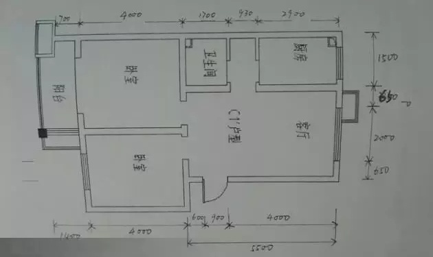

在前期设计中，必须还要做一件事，就是**对自己的房子进行一次详细的测量**，测量的内容主要包括：

**1、明确装修过程涉及的面积**

特别是贴砖面积、墙面漆面积、壁纸面积、地板面积

**2、明确主要墙面尺寸**

特别是以后需要设计摆放家具的墙面尺寸。顺道提醒大家，开工之前不要忘记去物业办理开工手续，交纳装修押金

（二）主体拆改

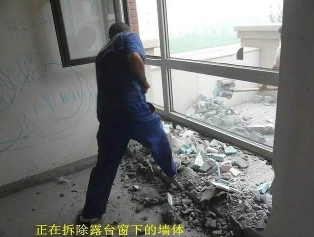

进入到施工阶段，主体拆改是最先上的一个项目，主要包括拆墙、砌墙、铲墙皮、换塑钢窗等等，说得明了，就是先把工地的框架先搭起来

（三）水电改造

水电路改造之前，主体结构拆改应该基本完成了

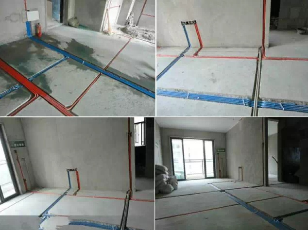

**在水电改造和主体拆改这两个环节之间，还应该进行橱柜的第一次测量**

其实所谓的橱柜第一次测量并没有什么实际内容，因为墙面和地面都没有处理，橱柜设计师不可能给出具体的设计尺寸，而只是就开发商预留的上水口、油烟机插座的位置，提出一些相关建议。主要包括：

1、看看油烟机插座的位置是否影响以后油烟机的安装

2、看看水表的位置是否合适

3、看看上水口的位置是否便于以后安装水槽

**水路改造完成之后，最好紧接着把卫生间的防水做了**

有些业主一直认为装修开始之前，一些主料应该事先进场。小本要说的是，除非是主体拆改需要用的主料，否则，诸如瓷砖、大芯板等主料的进场时间应该在水电改造之后。因为电路改造如果涉及地面开槽的话，瓷砖、大芯板码放的位置不当，工人搬来搬去很是麻烦，在此提醒注意

（四）木工

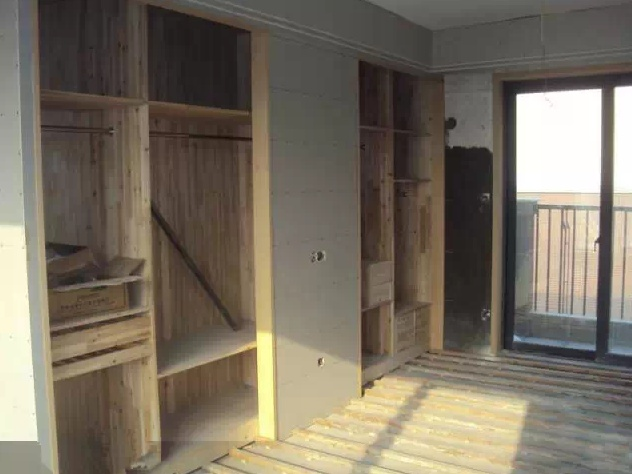

木工、瓦工、油工是施工环节的“三兄弟”，**基本出场顺序是：木——瓦——油** 基本出场原则是——谁脏谁先上。“谁脏谁先上”也是决定家装顺序的一个基本原则之一，其实像包立管、做装饰吊顶、贴石膏线之类的木工活从某种意义上说也可以作为主体拆改的一个细环节考虑，本身和水电路改造并不冲突，有时候还需要一些配合，就像家里如果准备做假墙的话，要考虑假墙上是否有水电线路，如果有的话，应该让水电改造的工人预埋管

（五）贴砖

如果工人忙得开的话，工长一般会在“木工老大”还没有结束的时候就让“瓦工老二”进场贴砖，这很正常，因为两者本身没什么冲突

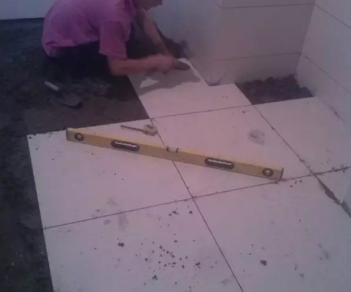

在“瓦工老二”作业的过程，还涉及以下两个环节的安装：

**1、过门石、大理石窗台的安装**

过门石的安装可以和铺地砖一起完成，也可以在铺地砖之后，大理石窗台的安装一般在窗套做好之后，安装大理石的工人会准备玻璃胶，顺手就把大理石和窗套用玻璃胶封住了。

**2、地漏的安装**

地漏是家装五金件中第一个出场的，因为它要和地砖共同配合安装，所以，大家在开始逛建材的时候，应该早点买地漏

“瓦工老二”离场，这时候可以约橱柜第二次测量了，**准确地说，在厨房墙地砖贴完之后，就可以约橱柜第二次测量**

（六）刷墙面漆

“油工老三”进场，主要完成墙面基层处理、刷面漆、给“木工老大”打的家具上漆等工作

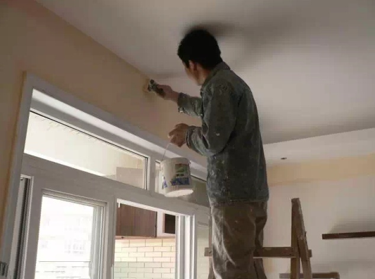

**准备贴壁纸的业主，只需要让“油工老三”在计划贴壁纸的墙面做基层处理就可以**

至于是否要留最后一遍面漆，这个问题没必要太较真儿，从很多业主装修过的经验来看，留一遍面漆的意义不是很大，因为后面的操作没有比刷漆再脏的了

当“老大”、“老二”、“老三”相继离场之后，很多业主会认为自己的装修快结束了，其实按环节来数的话，三分之一还不到。大家之所以有这种感觉是因为，**人们普遍理解的装修只是装修的“施工环节”，其实装修的“安装环节”也是装修的重头所在**

如果说“设计环节”是把我们未来家的样子“构想”一下的话，那么“施工环节”就是把我们的家“包装”一下，真正说“置备”家当几乎都在“安装环节”

（七）热水器安装

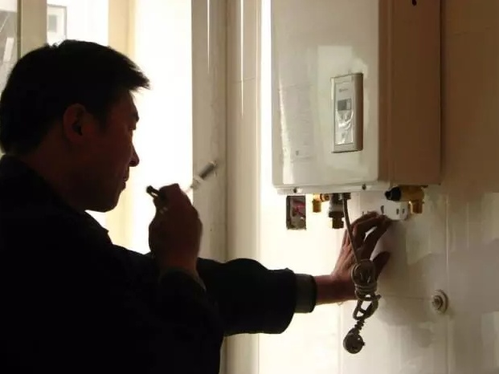

**墙面、地面装修完毕后即可通知热水器送货、安装**

热水器安装一般在吊顶之前，燃气热水器成为现在的趋势，一般安装在厨房或者封闭式阳台，如果是电热水器，则安装在卫生间

（八）厨卫吊顶

热水器安装完了的下一步就是吊顶

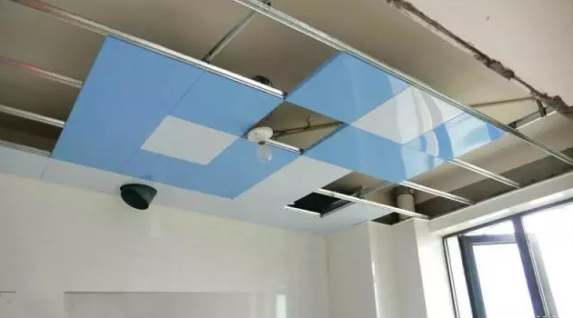

厨卫吊顶作为安装环节打头阵的，还是在延续对家的“包装”

在厨卫吊顶的同时，厨卫的防潮吸顶灯、排风扇（浴霸）应该已经买好了，一般都是厨卫吸顶灯、排风扇（浴霸）同时装好，建议面积较小的家庭就不要装太复杂的吊顶，否则会让空间更加狭小

（九）橱柜安装

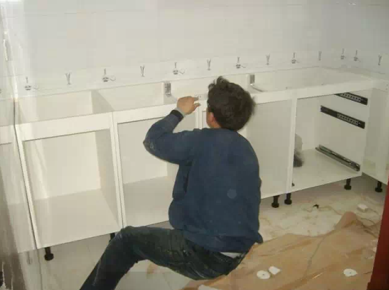

吊顶结束后，可以约橱柜上门安装了

同时安装的还有**水槽（可以不包括上下水件）和煤气灶**，橱柜安装之前最好协调物业把煤气通了，因为煤气灶装好之后需要试气

（十）烟机炤具安装

**烟机灶安装最好能和橱柜安装安排到同一天**，方便双方师傅协调

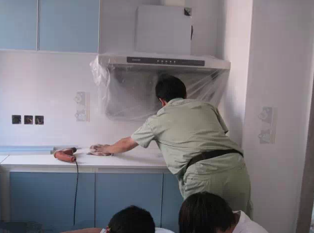

11. 木门安装

在橱柜安装的第二天，早在一个多月前木门测量完成后，现在可以约安装了，，**装门的同时要安装的合页、门锁、地吸**。 实木门的制作周期一般为30天到45天左右，所以，为了让工期衔接紧密，要**在主体拆改完成之后尽早让木门厂家上门就门洞尺寸进行测量。贴完砖确切的测量**

关于门洞的处理，大家需要注意一点，如果家里门洞的高度不一致，需要工人处理成等高，这样会比较好看

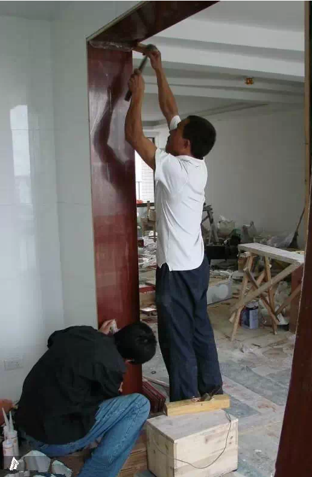

（十二）地板安装

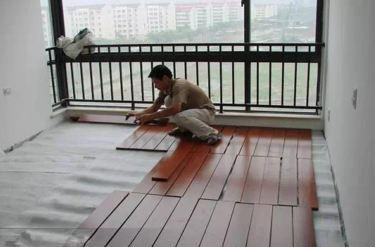

**在木门安装的第二天就可以安装地板了**，需要注意以下几个问题：

### 1、地板安装之前，最好让厂家上门勘测一下地面**是否需要找平或局部找平**，有的装修公司或整修队会建议大家地面找平或局部找平，以地板厂家的实际勘测为准

2、地板安装之前，家里的铺装地板的**地面要清扫干净**，要保证地面的干燥，但在清扫过程不要用水

（十三）铺贴壁纸

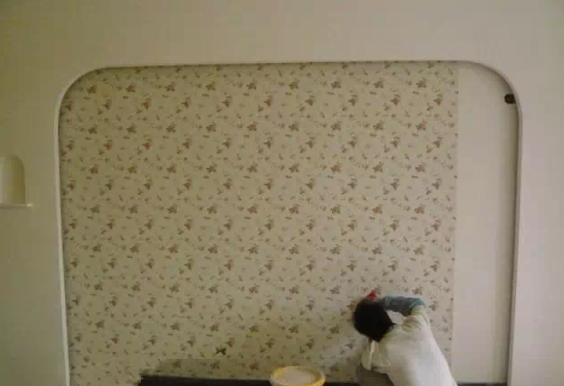

在地板安装的第二天，家里收拾干净了，就可以约壁纸铺贴，**铺贴壁纸之前，墙面上要尽量做到“什么都不要有”**

顺利的话，同样是一天的时间，有条件的话，铺贴壁纸的当天，地板应该做一下保护，没条件也没关系，把清理地板上遗留的壁纸胶交给保洁也没问题

（十四）开关插座安装

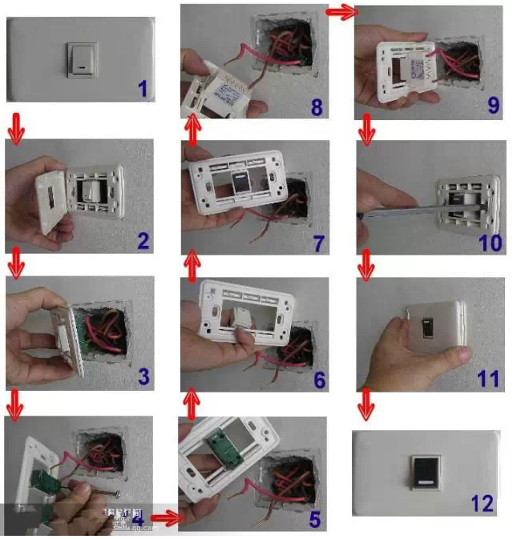

在卫生间里，所有插座和开关都必须是防水的，插座要带盖子

入口处的电灯开关,建议使用感应型或者荧光型，回家省得摸黑

开关插座宁多也不要少，**在布置插座的地方，至少要保留有一个插座**。要知道，一般家用电器都会越来越多，一旦有了新电器却没有插座时，要想再安装就难了

（十五）灯具安装

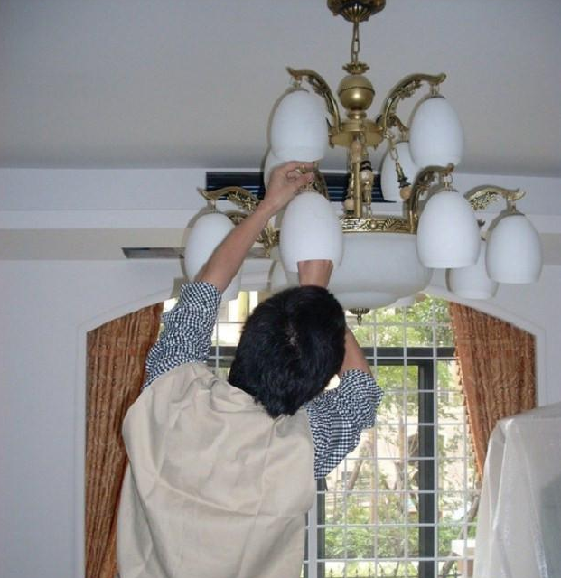

在装灯具时，如果装上**分控开关**，可以省去很多烦恼

因为如果只有一个总开关，几盏灯同开同闭，就不能选择光线的明暗，也会浪费电能，而装上分控开关可以随时根据需要选择开几盏灯。如果房屋进门处有过道，**在过道的末端最好也装一个开关，这样进门后就能直接关掉电源，而不需要再走回门口关灯**

（十六）五金洁具安装

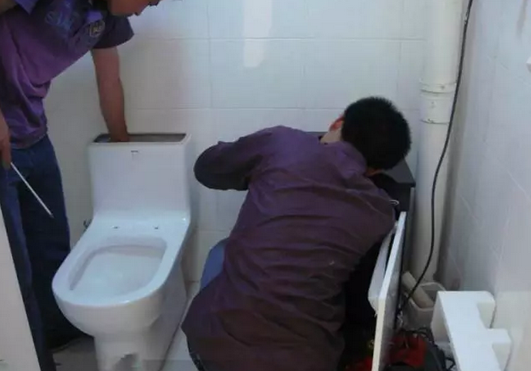

之前买好的上下水管件、卫浴挂件、马桶、晾衣架等等，一并就都装上。前面那些“大件”装好之后，家里仍然十分“生冷”，等到灯具、五金洁具装好之后，家里就“活”了，不夸张地说，你第一次打开龙水看着水“哗、哗”的往出流，心里都会挺美

（十七）窗帘杆安装

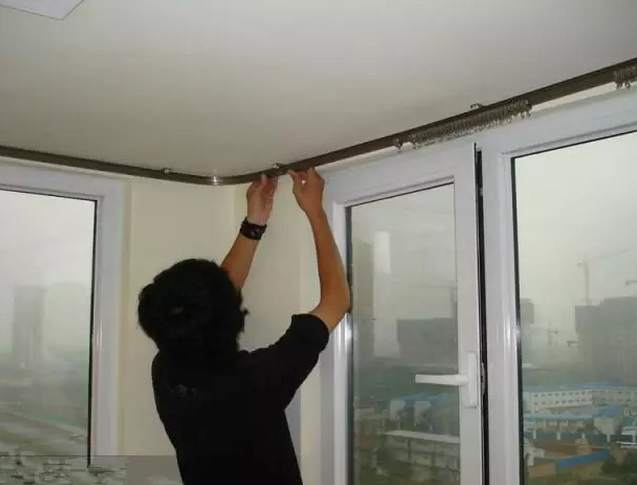

窗帘杆的安装标志着家装的基本结束

小伙伴们可以歇一口气了，忙的昏天暗地的装修日子终于迎来来曙光

（十八）保洁打扫

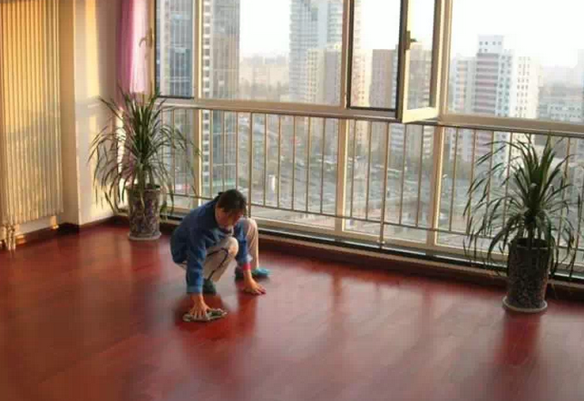

拓荒保洁之前，不要装窗帘

打扫时，家里不要有家具和不必需的家电，要尽量保持更多的“平面”，以便能够彻底的清扫

（十九）家具进场

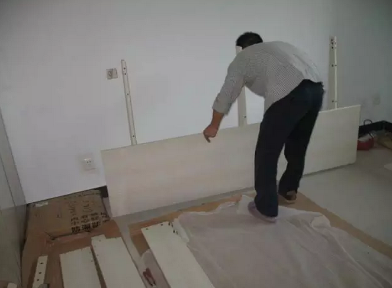

**关于家具购买的时间，建议是最早也要在水电路改造完成之后**，这样，选择家具的基本尺寸范围我们心里才大致有数。所以，有的在装修还没开始之前，已经急着把家具都订了，可能会有尺寸不符的问题，不过可以先把家具的大致风格定下来

（二十）家电进场

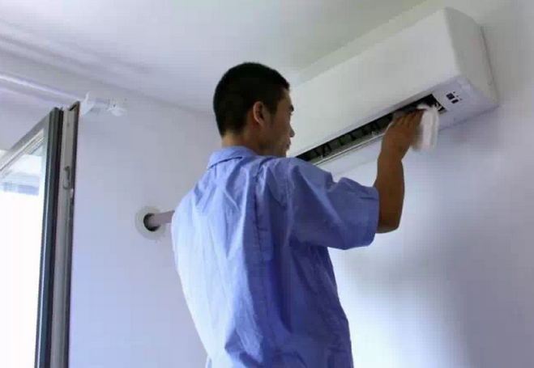

到了这时候，家电该进场的进场，该安装的安装，准备入住了！

（二十一）家居配饰

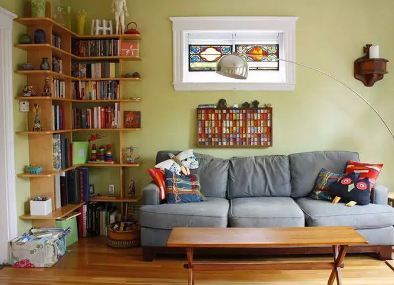

家居配饰，家装的最后一步，而且已经由装修转为装饰了，包括窗帘的安装都属于家居配饰环节

至于买窗帘，小本之前就提醒过大家，最好是在订好家具之后，以免风格冲突。家居配饰还包括可以考虑买一些绿色植物、挂墙画、摆设工艺品等

入住之后，大家就可以自由发挥了，提醒大家，**入住之前，先测测甲醛、治理下空气、通通风，毕竟健康最重要！**

**三、装修过程的两种划分**

（一）大家已经对这21步有了初步理解，仔细看的亲会发现，文中还夹带的一些需要注意的环节，所以整合之后具体如下：

1、办理开工手续  2、自行测量  3、前期设计

4、主体拆改  5、木门厂家上门测量  6、橱柜第一次测量

7、水电改造  8、卫生间防水  9、主料进场 

10、木工  11、贴砖（安装窗台、地漏）  12、淋浴隔断量尺  13、橱柜第二次测量

14、刷墙面漆  15、厨卫吊顶  16、通煤气  17、橱柜安装（同时安装水槽、煤气灶）

18、木门安装  19、地板安装  20、铺贴壁纸 

21、开关插座安装  22、灯具安装  23、五金洁具安装  24、窗帘杆安装

25、保洁  26、家具进场  27、家电安装  28、家居配饰

29、入住

（二）装修全过程的六步划分

按照工程特点，按照刚刚提到的29个环节划分，装修的全过程也可以分为以下六步：

第一步：设计思路（3）

第二步：主体拆改（4）

第三步：隐蔽工程（7）

第四步：覆盖工程（10、11、14、15、19、20）

第五步：安装阶段（17、18、21、22、23、24、25）

第六步：收尾阶段（26、27、28、29）

简单的流程：

1、交房验房 2、量房设计3、主体拆改 4、水电改造5、地暖铺设

6、防水处理7、木工工程8、瓷砖铺设（木工和贴砖两个谁前谁后都可以）9、油漆工程 10、橱柜厨电安装（热水器安装 -- 厨卫吊顶 -- 橱柜安装-- 烟机灶安装 ）

11、木门安装 12、地板安装 13、 壁纸铺贴 14、开关插座安装 15、灯具安装

16、卫浴安装 17、衣柜安装 18、窗帘安装 19.拓荒保洁 20、家具家电进场 家居配饰

（ 开关插座安装 .灯具安装.五金洁具安装 --窗帘杆安装）这些谁前谁后没有太多要求

**需要免费进群学习装修猫腻一起团购省钱的加微信：zoo9999995**
